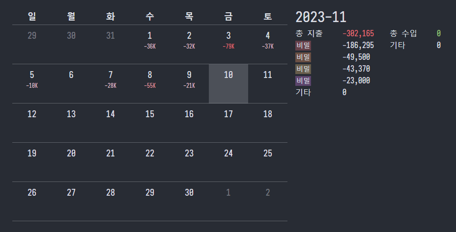
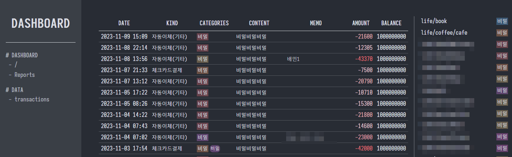
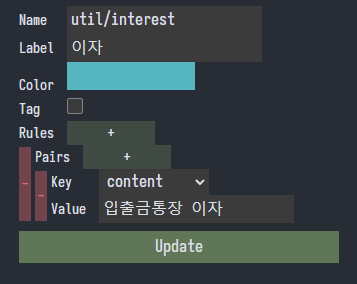

# jen2

> WIP

Not a just answering machine, but a personal data assistant.

## Preview

## Features

- [ ] accounts ledger
- [ ] personal data analyzer
- [ ] bookmark manager
- [ ] rss/* aggregator/feeder

### Accounts Ledger

import transactions from KakaoBank using export to csv and read through mail. [external mail csv fetcher](https://github.com/20chan/jen2-fetcher)

supports automatic-programmatic categorization using regex and some patterns.
currently working on monthly reports, and feedbacks.